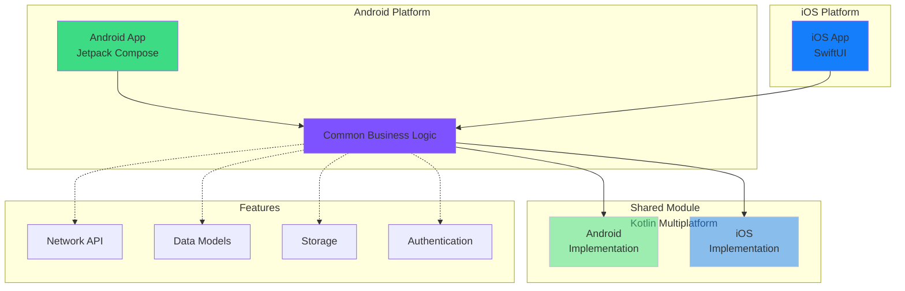
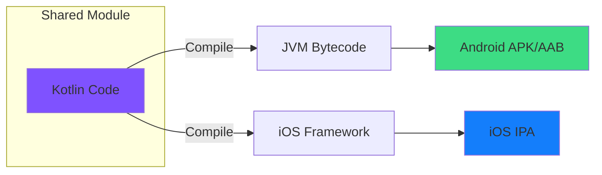
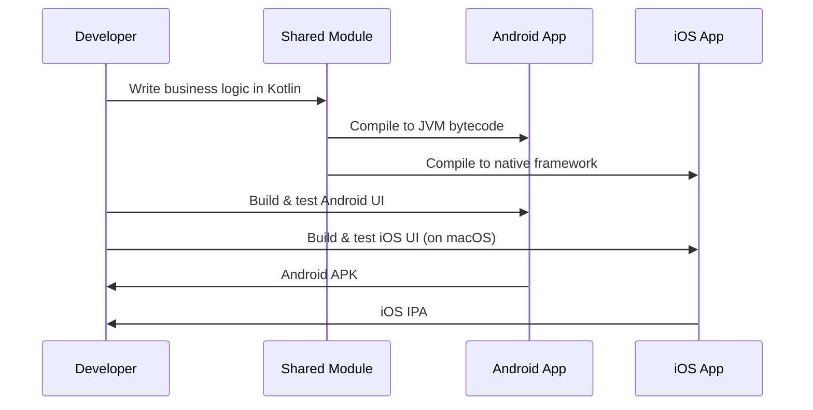
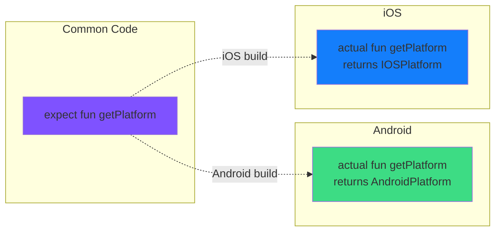

# MyEDU Architecture Diagram

## Cross-Platform Architecture



## Build Flow



## Directory Structure

```
MyEDU/
│
├── 📱 app/                          # Android Application
│   ├── src/
│   │   └── main/
│   │       ├── java/                # Kotlin/Java source
│   │       ├── res/                 # Android resources
│   │       └── AndroidManifest.xml
│   └── build.gradle.kts
│
├── 🔄 shared/                       # Kotlin Multiplatform Module
│   ├── src/
│   │   ├── commonMain/kotlin/       # ✨ Shared code (both platforms)
│   │   │   └── myedu/oshsu/kg/shared/
│   │   │       ├── Platform.kt      # Platform interface
│   │   │       └── Greeting.kt      # Example shared logic
│   │   │
│   │   ├── androidMain/kotlin/      # 🤖 Android-specific code
│   │   │   └── myedu/oshsu/kg/shared/
│   │   │       └── Platform.kt      # Android implementation
│   │   │
│   │   └── iosMain/kotlin/          # 🍎 iOS-specific code
│   │       └── myedu/oshsu/kg/shared/
│   │           └── Platform.kt      # iOS implementation
│   │
│   └── build.gradle.kts             # KMM configuration
│
├── 🍎 iosApp/                       # iOS Application
│   ├── iosApp.xcodeproj/            # Xcode project
│   └── iosApp/
│       ├── iOSApp.swift             # App entry point
│       ├── ContentView.swift        # SwiftUI views
│       └── Assets.xcassets/         # iOS assets
│
├── 📚 Documentation
│   ├── README.md                    # Main documentation
│   ├── IOS_BUILD_GUIDE.md          # iOS build instructions
│   └── IOS_IMPLEMENTATION_SUMMARY.md # This implementation summary
│
└── ⚙️ Configuration
    ├── build.gradle.kts             # Root build configuration
    ├── settings.gradle.kts          # Project structure
    └── gradle.properties            # Build properties
```

## Development Workflow



## Expect/Actual Pattern

This pattern allows platform-specific implementations of shared interfaces:



## Platform Comparison

| Aspect | Android | iOS |
|--------|---------|-----|
| **UI Framework** | Jetpack Compose | SwiftUI |
| **Language** | Kotlin | Swift |
| **Shared Code** | ✅ Via Kotlin JVM | ✅ Via Kotlin/Native |
| **Build Tool** | Gradle | Xcode |
| **Distribution** | Google Play Store | Apple App Store |
| **Development OS** | Windows, macOS, Linux | macOS only |
| **Minimum Version** | Android 7.0 (API 24) | iOS 14.0 |

## Key Advantages

### 🎯 Code Sharing
- Business logic written once
- Bug fixes apply to both platforms
- Consistent behavior across platforms

### 🚀 Performance
- Native UI on both platforms
- No performance overhead from bridging
- Platform-optimized compilation

### 🔧 Flexibility
- Platform-specific features when needed
- Native look and feel maintained
- Easy to add platform-exclusive functionality

### 📦 Maintainability
- Single codebase for core logic
- Easier to test shared components
- Reduced development time for new features
